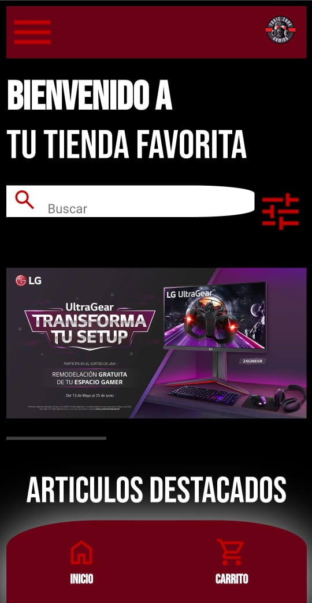
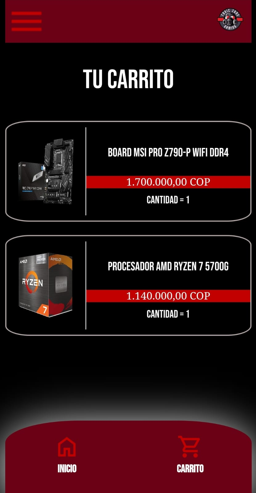
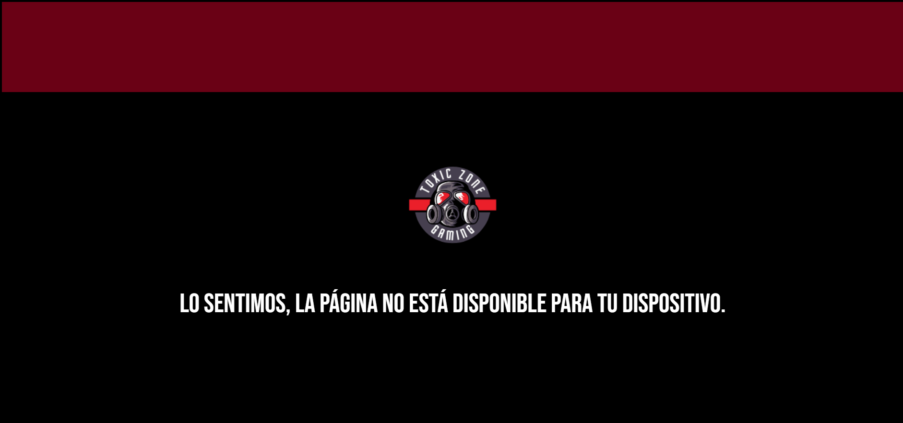

## Table of Contents
1. [General Info](#general-info)
2. [screensots](#screenshot)
3. [Technologies](#technologies)
### General Info
***
El repositorio cuenta con 4 ARCHIVOS de HTML y 3 de CSS; estos se encargan de mostrar un menú principal con artículos el cual contiene un botón para ver más información de este mismo al apretar el botón este lo lleva a la página donde describe el artículo más a detalle con características y descripción del producto para información sobre los pedidos que se hacen en la página se encuentra el carrito el cual contiene esta información. La pagines es responsive por lo cual se agrego una condicion a la cual si se intenta entrar desde un dispositivo de escritorio esta mostrara un mensaje ya que el la pagina es solo para dispositivos moviles. el proyecto se plantea a futuro a agregar funcionalidad a otras características como lo son la implementacion de el uso de base de datos y JavaScript
### Screenshot
VISTA PRINCIPAL

VER MAS DETALLES

CARRITO DE COMPRAS

VISTA DESDE UN DISPOSITIVO DE ESCRITORIO

## Technologies
***
A list of technologies used within the project:
* [HTML](HTML): Version 5.0
* [CSS](CSS): Version 3.0
